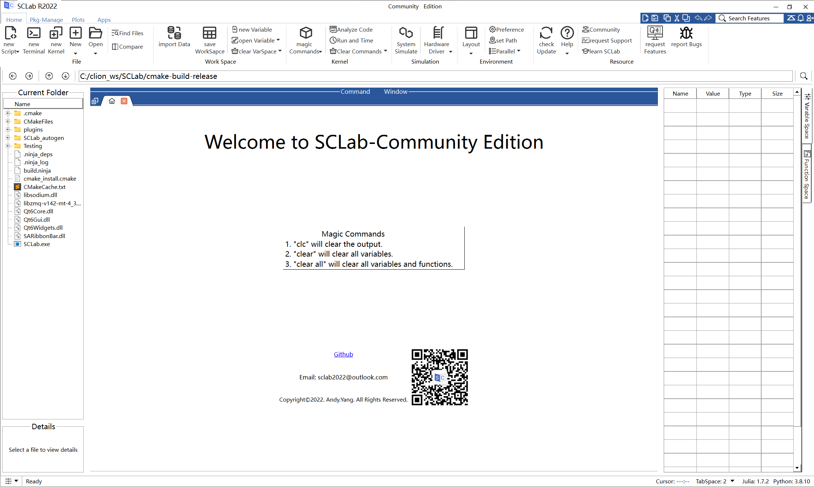

# SCLab

## 一、起源

SCLab命名起源于Science Compute Labrary，目标是构建一个类似于Matlab的科学计算工具。

前端界面及功能类似于Matlab，后端的计算引擎计划选择Julia，但不排除也会使用Python。

目前由于是业余时间开发，进展比较缓慢，欢迎感兴趣的朋友一起参与。

## 二、开发环境

- OS：Win10/Win11
- IDE：CLion
- Test：Google Test；Cpp-Check；

## 三、当前进展

主体界面设计完成，如下所示：

## 四、下一步计划

设计前端与后端之间的通信